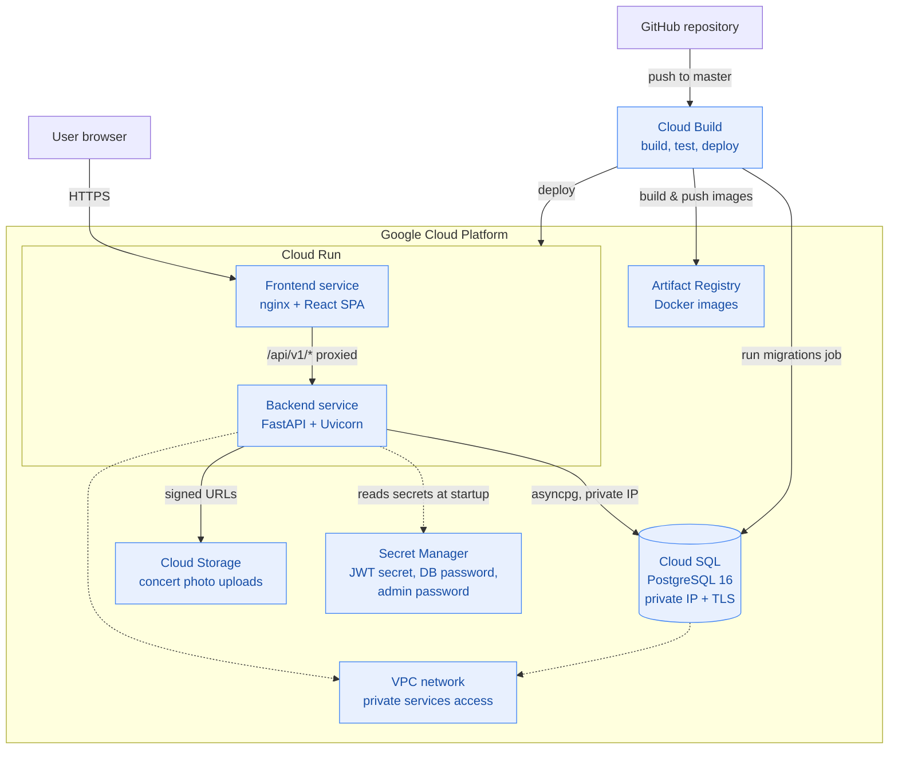
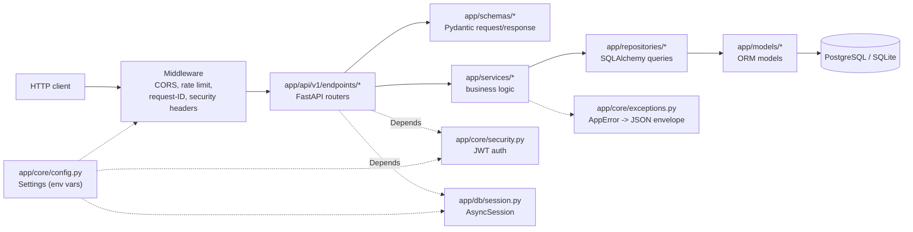
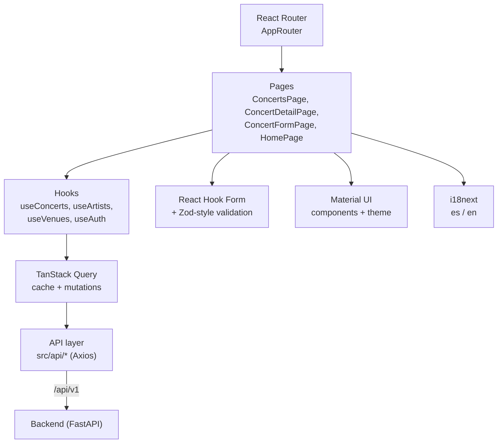
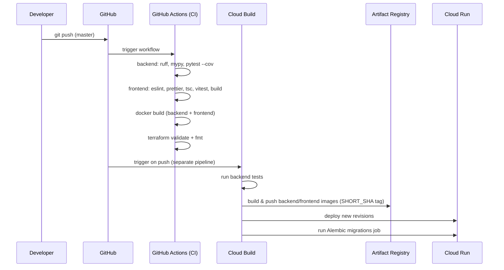

# Architecture

Live Memories is a full-stack app for cataloguing personal concert history: a **FastAPI** backend, a **React + TypeScript** frontend, and **Google Cloud Platform** infrastructure provisioned with Terraform.

---

## System overview

---

## Backend – layered architecture

The backend enforces a strict layering so business logic never touches HTTP or SQL concerns directly.

**Request flow example — `PUT /api/v1/concerts/{id}`:**

1. Middleware chain: rate limiter → request ID → CORS → security headers.
2. Router validates the path/body against `ConcertUpdate` (Pydantic).
3. `get_current_user` dependency verifies the JWT bearer token.
4. `ConcertService.update_concert()` fetches the entity via `ConcertRepository`, raises `AppError(CONCERT_NOT_FOUND)` if missing.
5. Repository issues an async SQLAlchemy `UPDATE` and re-fetches with eager-loaded relations.
6. Response is serialised through `ConcertResponse` and returned as JSON.

---

## Frontend – component/data flow

---

## Deployment pipeline

---

## Security boundaries

- **Backend Cloud Run service** is *not* publicly invokable — only the frontend's service account has `roles/run.invoker`.
- **Cloud SQL** has no public IP; reachable only via the VPC with enforced TLS (`ssl_mode = ENCRYPTED_ONLY`).
- **Secrets** (JWT signing key, DB password, admin password) are injected as env vars from **Secret Manager** at container start — never baked into images.
- **JWT auth**: all write endpoints (`POST`/`PUT`/`DELETE`) require a bearer token issued by `POST /api/v1/auth/token`; read endpoints (`GET`) are public.
- **Rate limiting**: in-memory sliding window (120 req/60s per IP), bypassing `/health` and `/ready` so orchestrator probes are never throttled.
- **Docs disabled in production**: `/docs`, `/redoc`, `/openapi.json` only exist when `APP_ENV != production`.

See [SECURITY.md](../SECURITY.md) for the vulnerability disclosure process and [API.md](API.md) for the full endpoint reference.
